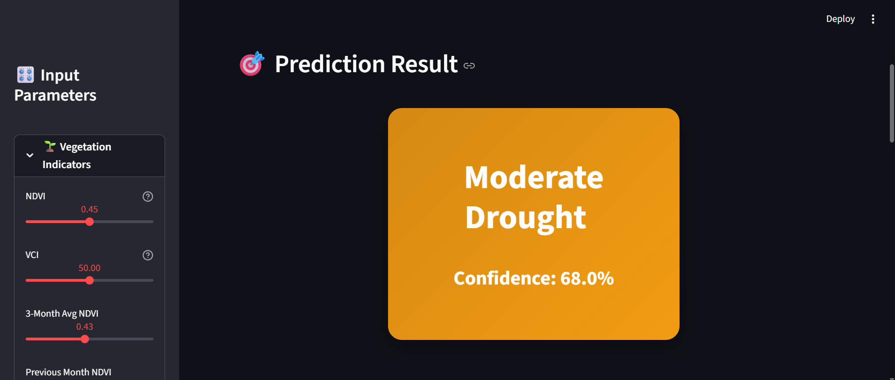
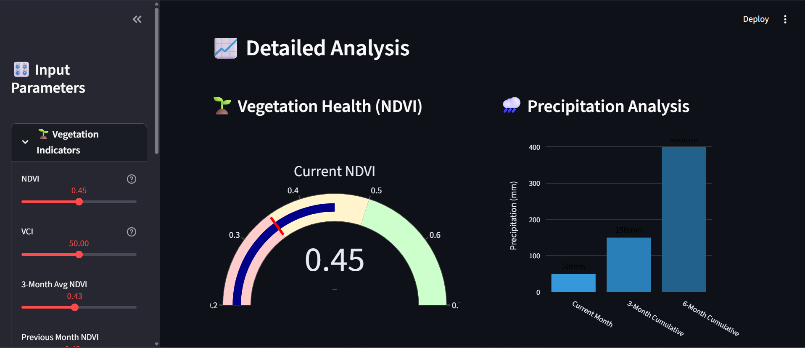

# 🌾 Agricultural Drought Prediction System


An end-to-end machine learning system for predicting agricultural drought conditions in Maharashtra, India using satellite data from Google Earth Engine.


## 🎯 Overview

This project addresses the critical challenge of agricultural drought prediction using multi-source satellite data and ensemble machine learning models. With 87.5% prediction accuracy, the system can classify drought severity into three categories: No Drought, Moderate Drought, and Severe Drought.

### Key Features

- **Real-time Predictions**: Interactive web dashboard for drought risk assessment
- **Satellite Data Integration**: 10 years of MODIS NDVI, CHIRPS precipitation, and ERA5 temperature data
- **Ensemble ML Models**: Random Forest and XGBoost with 87.5% accuracy
- **Comprehensive Analysis**: Feature importance, temporal patterns, and seasonal trends
- **Interactive Visualizations**: Gauges, probability distributions, and risk indicators

## 📊 Dataset

**Source**: Google Earth Engine
- **MODIS NDVI**: Vegetation health monitoring (2015-2024)
- **CHIRPS**: Daily precipitation data
- **ERA5**: Temperature measurements

**Size**: 118 months of observations  
**Region**: Maharashtra, India (Lat: 15.6-22.0°N, Lon: 72.6-80.9°E)  
**Features**: 19 engineered features including rolling averages, lag variables, and drought indices

## 🚀 Installation

### Prerequisites
```bash
Python 3.8+
pip
```

### Setup

1. **Clone the repository**
```bash
git clone https://github.com/SubramaniMokkala/agricultural-drought-prediction.git
cd agricultural-drought-prediction
```

2. **Install dependencies**
```bash
pip install -r requirements.txt
```

3. **Run the Streamlit dashboard**
```bash
streamlit run app.py
```

The dashboard will open in your browser at `http://localhost:8501`

## 📁 Project Structure
```
agricultural-drought-prediction/
├── app.py                          # Streamlit web application
├── data/
│   ├── drought_dataset_2015_2024.csv
│   ├── drought_dataset_processed.csv
│   └── monthly_precipitation_2023.csv
├── models/
│   ├── random_forest_drought_model.pkl
│   └── scaler.pkl
├── notebooks/
│   ├── 01_exploratory_analysis.ipynb
│   └── 02_model_building.ipynb
├── outputs/
│   ├── screenshots/
│   ├── model_comparison.png
│   ├── confusion_matrices.png
│   └── feature_importance.png
├── src/
│   ├── data_exploration.py
│   ├── fetch_complete_data.py
│   ├── feature_engineering.py
│   └── quick_eda.py
├── requirements.txt
└── README.md
```

## 🎓 Methodology

### 1. Data Collection
- Accessed Google Earth Engine API for satellite data
- Collected 118 months of multi-source observations
- Region: Maharashtra, India

### 2. Feature Engineering
- Created rolling precipitation sums (3-month, 6-month)
- Calculated Vegetation Condition Index (VCI)
- Generated temporal lag features
- Computed precipitation anomalies

### 3. Model Training
Trained and compared three models:
- **Logistic Regression**: 79.17% accuracy
- **Random Forest**: **87.50% accuracy** ⭐
- **XGBoost**: **87.50% accuracy** ⭐

### 4. Deployment
Built interactive Streamlit dashboard with real-time predictions

## 📈 Results

### Model Performance

| Model | Accuracy | Precision | Recall | F1-Score |
|-------|----------|-----------|--------|----------|
| Logistic Regression | 79.17% | 75.69% | 79.17% | 77.36% |
| Random Forest | **87.50%** | 86.70% | 87.50% | 86.49% |
| XGBoost | **87.50%** | 85.76% | 87.50% | 86.34% |

### Feature Importance (Random Forest)

1. **VCI** (Vegetation Condition Index) - 26.4%
2. **NDVI** (Normalized Difference Vegetation Index) - 18.1%
3. **6-Month Precipitation** - 13.3%
4. **3-Month Average Precipitation** - 9.8%
5. **3-Month Precipitation** - 9.5%

## 🖼️ Screenshots

### Dashboard Overview


### Prediction Results


### Analysis Visualizations


## 🔬 Research Applications

This system addresses critical research questions:
- Cross-regional model transferability
- Optimal temporal windows for drought prediction
- Integration of meteorological and socioeconomic factors
- Early warning system development for vulnerable regions

## 🛠️ Technologies Used

- **Python 3.13**: Core programming language
- **Google Earth Engine**: Satellite data access
- **Scikit-learn**: Machine learning models
- **XGBoost**: Gradient boosting
- **Pandas & NumPy**: Data manipulation
- **Matplotlib & Seaborn**: Static visualizations
- **Plotly**: Interactive charts
- **Streamlit**: Web application framework

## 👤 Author

**Subramani Mokkala**
- 🎓 B.Tech in Computer Science - Data Science, KG Reddy College of Engineering
- 📧 Email: [subramanimokkala@gmail.com]
- 🔗 LinkedIn: [[Subramani Mokkala](https://www.linkedin.com/in/subramani-mokkala-727683245/)]

## 📄 License

This project is licensed under the MIT License - see the LICENSE file for details.

## 🙏 Acknowledgments

- Google Earth Engine for satellite data access
- NOAA for CHIRPS precipitation data
- ERA5 for temperature measurements
- MODIS team for vegetation indices

**⭐ If you find this project useful, please consider giving it a star!**
